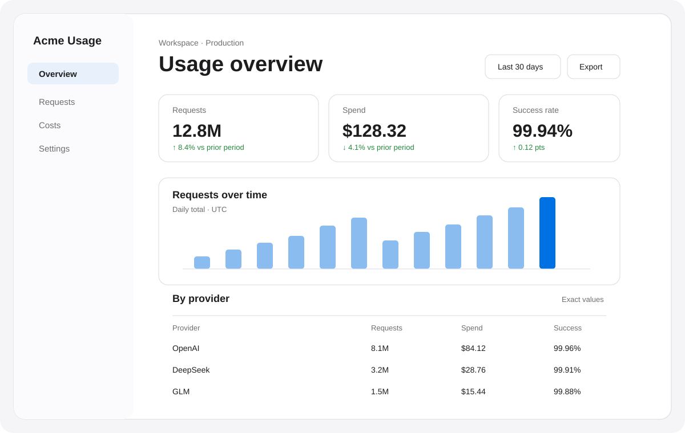

# apple-ui-design

Apple-inspired UI design guidance for AI coding agents.

This is a reusable design skill for building clean, native-feeling interfaces without turning every page into a glassmorphism card grid. It translates Apple Human Interface Guidelines ideas into decisions an AI coding agent can apply: content hierarchy, semantic tokens, adaptive layout, navigation, states, accessibility, restrained materials, and purposeful motion.

> **Apple-inspired, not Apple-made.** This project is independent, uses original guidance, contains no Apple assets or fonts, and is not endorsed by Apple.


A small, dependency-free [Dashboard Demo](examples/dashboard/index.html) shows the intended direction: fewer metrics, explicit scope, exact values, light/dark tokens, and no decorative glass.

[中文说明](#中文说明) · [安装](#install-and-use) · [示例](examples/README.md)

## v0.1 focus

The first release is deliberately strongest for:

- Web applications
- Analytics and usage dashboards
- Operational admin panels

Native-oriented `ios` and `macos` profiles are included for deliberate platform work, but they do not encourage fake system chrome on ordinary websites.

## What makes it different

The goal is not “add rounded corners and blur.” The skill turns this sequence into executable design guidance:

```text
Apple design principles
        ↓
semantic UI decisions
        ↓
consistent AI-generated interfaces
```

It explicitly guards against common AI-generated UI failure modes: excessive cards, random gradients, oversized hero text, ornamental glass, generic Bootstrap-admin density, unclear hierarchy, and color-only status.

## Structure

```text
apple-ui-design/
├── SKILL.md
├── README.md
├── LICENSE
├── VERSION
├── CHANGELOG.md
├── references/
│   ├── foundations.md
│   ├── components.md
│   ├── layout.md
│   ├── typography.md
│   ├── color.md
│   ├── materials.md
│   ├── motion.md
│   └── dashboard.md
├── profiles/
│   ├── web.md
│   ├── dashboard.md
│   ├── admin.md
│   ├── ios.md
│   └── macos.md
└── examples/
    ├── dashboard/
    ├── landing-page/
    └── admin-panel/
```

## Install and use

### Codex

Copy the `apple-ui-design` folder into `~/.codex/skills/`, restart or start a new task, then invoke it explicitly:

```text
$apple-ui-design

Redesign the current dashboard. Keep the data contracts and business logic.
Use the dashboard profile. Support light/dark mode, keyboard navigation,
responsive layout, loading/empty/error states, and reduced motion.
```

It can also be selected automatically when the request clearly matches the skill description.

### Claude Code

Copy the folder into the project's `.claude/skills/` directory (or copy the core instructions into the project's `CLAUDE.md`). Tell Claude which profile and references to read:

```text
Use apple-ui-design/SKILL.md and profiles/dashboard.md.
Read references/foundations.md, components.md, layout.md, color.md,
and dashboard.md before editing the UI.
```

### Cursor, Cline, and other agents

Add the core rules from `SKILL.md` to the agent's project rules, then include only the relevant profile and references as context. For a normal web app use `web`; for data-heavy or operational work use `dashboard` or `admin`. Keep the anti-pattern gate and accessibility requirements intact.

## Recommended request shape

```text
Use apple-ui-design.
Profile: dashboard.
Preserve existing routes, APIs, data models, and business logic.
First map the information hierarchy, then implement the smallest coherent UI change.
Verify light/dark, compact/wide layouts, keyboard focus, reduced motion,
and loading/empty/error states. Avoid excessive cards, gradients, and blur.
```

## Contributing

Keep the core small and decision-oriented. Put substantial platform or scenario guidance in `references/` or `profiles/`, not in a larger universal prompt. A proposed rule should address a demonstrated failure mode and include a concrete before/after decision when possible.

Do not add Apple screenshots, Apple logos, Apple fonts, or copied HIG text. Link to official Apple guidance and write original paraphrases instead. Keep the project independent and Apple-inspired in its wording.

## References

- [Apple Human Interface Guidelines](https://developer.apple.com/design/human-interface-guidelines/)
- [Design principles](https://developer.apple.com/design/human-interface-guidelines/design-principles)
- [Accessibility](https://developer.apple.com/design/human-interface-guidelines/accessibility)
- [Color](https://developer.apple.com/design/human-interface-guidelines/color)
- [Materials](https://developer.apple.com/design/human-interface-guidelines/materials)
- [SF Symbols](https://developer.apple.com/design/human-interface-guidelines/sf-symbols)

## 中文说明

`apple-ui-design` 是一套给 Codex、Claude Code、Cursor、Cline 等 AI Coding Agent 使用的 Apple-inspired UI 设计规范。它不是 Apple 官方插件，也不是单纯的“毛玻璃 + 大圆角”提示词，而是把 Apple HIG 的设计思路整理成可复用的界面决策规则。

### 适用范围

当前 `v0.1` 重点支持三类项目：

- Web App：内容优先、清晰导航、响应式布局和一致的交互状态。
- Dashboard：指标、趋势图、筛选器、表格、数据密度和明暗模式。
- Admin Panel：侧边栏、搜索、批量操作、表单、权限和危险操作。

同时提供 `ios` 与 `macos` profile，用于原生项目或明确要求平台化交互的项目；普通网站不要伪造 iOS/macOS 系统外壳。

### 核心原则

1. 先理解用户任务和信息层级，再决定布局和视觉风格。
2. 用语义色、Light/Dark Mode、可访问焦点和完整状态保证稳定性。
3. 用留白、排版、对齐和层级表达结构，不要让每个区域都变成卡片。
4. 材料、透明度、模糊和动效只在能表达层级或上下文时使用。
5. 保留现有业务逻辑、接口、路由和数据模型，优先复用项目已有组件。
6. 避免紫色 AI 渐变、过度玻璃拟态、霓虹光效、Bootstrap Admin 感和无意义的巨大标题。

### 在 Codex 中使用

```text
$apple-ui-design

请重新设计当前 Dashboard 的 UI。
使用 dashboard profile，保留现有 API、路由和业务逻辑。
支持 Light/Dark Mode、响应式布局、键盘导航、加载/空数据/错误状态和 reduced motion。
避免过量卡片、紫色渐变、装饰性毛玻璃和 AI 味视觉。
```

根据任务选择 profile：

- 普通产品或营销页：`profiles/web.md`
- 数据分析或用量统计：`profiles/dashboard.md`
- 后台管理和运营流程：`profiles/admin.md`
- 原生 iPhone/iPad：`profiles/ios.md`
- 原生 Mac：`profiles/macos.md`

### 文件怎么读

不要每次加载全部文档。通常先读 `SKILL.md` 和 `references/foundations.md`，然后按任务补充：

- 布局/排版/颜色调整：`layout.md`、`typography.md`、`color.md`
- 组件、搜索、表格、表单、弹层：`components.md`
- 透明度、模糊、Vibrancy、层级：`materials.md`
- 动画和交互反馈：`motion.md`
- 指标、图表、筛选、数据表格：`dashboard.md`

### 重要边界

本项目是独立的 Apple-inspired 设计 Skill，不代表 Apple，也不包含 Apple Logo、Apple 字体或 Apple 设计资源。使用 SF Symbols、系统字体或 Apple 设计资源时，请自行确认对应平台和许可证要求。

